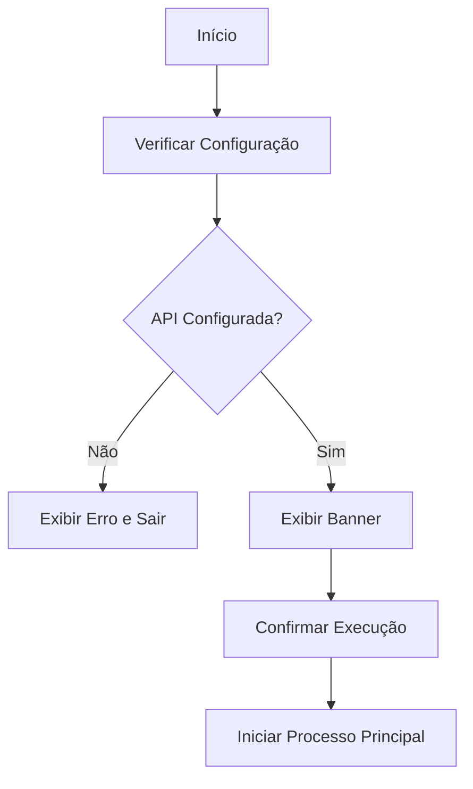
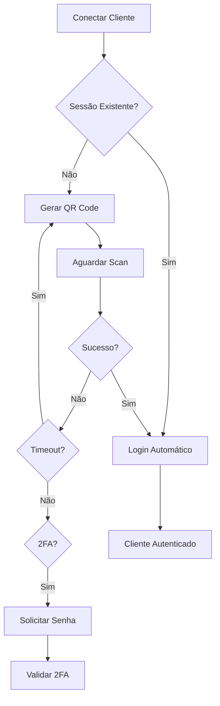
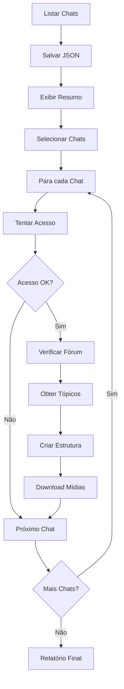

# Telegram Media Downloader - Documentação Técnica

## 📋 Índice
1. [Visão Geral](#visão-geral)
2. [Arquitetura do Sistema](#arquitetura-do-sistema)
3. [Módulos e Funcionalidades](#módulos-e-funcionalidades)
4. [Fluxo de Execução](#fluxo-de-execução)
5. [API e Métodos](#api-e-métodos)
6. [Configuração](#configuração)
7. [Estrutura de Dados](#estrutura-de-dados)
8. [Tratamento de Erros](#tratamento-de-erros)
9. [Logs e Monitoramento](#logs-e-monitoramento)
10. [Limitações e Considerações](#limitações-e-considerações)

---

## 🎯 Visão Geral

O **Telegram Media Downloader** é uma ferramenta automatizada desenvolvida em Python para download organizado de mídias e arquivos do Telegram. Utiliza a MTProto API através da biblioteca Telethon para acessar chats privados, grupos e canais, organizando automaticamente os arquivos baixados por tipo e tópico.

### Características Principais
- ✅ **Autenticação QR Code**: Login seguro sem necessidade de número de telefone
- ✅ **Organização Automática**: Estrutura de diretórios por tipo de mídia
- ✅ **Suporte a Fóruns**: Reconhece e organiza tópicos em grupos forum
- ✅ **Acesso Privado**: Múltiplas tentativas de acesso a chats privados
- ✅ **Logs Detalhados**: Registro completo de operações e progresso

---

## 🏗️ Arquitetura do Sistema

### Diagrama de Componentes
```
┌─────────────────────────────────────────────────────────────┐
│                    TELEGRAM DOWNLOADER                     │
├─────────────────────────────────────────────────────────────┤
│  telegram_downloader.py (Orchestrador Principal)           │
│  ├── Banner e Interface do Usuário                         │
│  ├── Controle de Fluxo Principal                          │
│  └── Relatórios e Feedback                                │
├─────────────────────────────────────────────────────────────┤
│  telethon_handlers.py (Core Telegram)                      │
│  ├── login_with_qr() - Autenticação QR                    │
│  ├── export_chat_list() - Lista de Chats                  │
│  ├── get_forum_topics() - Tópicos de Fórum                │
│  ├── export_media_organized() - Download Organizado       │
│  └── export_all_chats_media() - Processamento em Lote     │
├─────────────────────────────────────────────────────────────┤
│  file_utils.py (Utilitários de Arquivo)                    │
│  ├── sanitize_filename() - Sanitização                     │
│  ├── create_media_directories() - Estrutura de Pastas     │
│  ├── generate_filename() - Nomenclatura                    │
│  └── write_download_log() - Logging                       │
├─────────────────────────────────────────────────────────────┤
│  config.py (Configurações)                                 │
│  ├── API_ID e API_HASH                                    │
│  ├── Parâmetros de Download                               │
│  └── Mapeamento de Diretórios                             │
└─────────────────────────────────────────────────────────────┘
```

### Tecnologias Utilizadas
- **Python 3.8+**: Linguagem principal
- **Telethon**: Cliente MTProto para Telegram
- **asyncio**: Programação assíncrona
- **tqdm**: Barras de progresso
- **qrcode**: Geração de QR Code

---

## 📦 Módulos e Funcionalidades

### 1. `telegram_downloader.py` - Orchestrador Principal

#### Funções Principais:
- `main()`: Função principal que coordena todo o processo
- `print_banner()`: Exibe banner da aplicação
- `display_chat_summary()`: Mostra resumo dos chats encontrados
- `interactive_chat_selection()`: Seleção de chats para processamento
- `check_configuration()`: Valida configurações da API

#### Fluxo de Execução:
1. Verificação de configuração
2. Autenticação via QR Code
3. Exportação da lista de chats
4. Seleção de chats para download
5. Download organizado de mídias
6. Relatório final

### 2. `telethon_handlers.py` - Core Telegram

#### `login_with_qr()` - Autenticação
```python
async def login_with_qr(max_attempts: int = 5) -> Optional[TelegramClient]
```
**Funcionalidade**: Realiza login via QR Code com suporte a 2FA
**Retorna**: Cliente Telegram autenticado
**Características**:
- Renovação automática de QR Code expirado
- Suporte à autenticação 2FA
- Sessão persistente entre execuções
- Tratamento robusto de erros

#### `export_chat_list()` - Lista de Chats
```python
async def export_chat_list(client: TelegramClient) -> List[Dict]
```
**Funcionalidade**: Exporta lista completa de chats acessíveis
**Retorna**: Lista de dicionários com informações dos chats
**Dados Exportados**:
- ID do chat
- Título/Nome
- Username (se disponível)
- Tipo (Chat, Channel, etc.)
- Número de participantes
- Data de criação
- Indicador de forum

#### `get_forum_topics()` - Tópicos de Fórum
```python
async def get_forum_topics(client: TelegramClient, chat_entity) -> Dict[int, str]
```
**Funcionalidade**: Obtém tópicos de grupos forum
**Retorna**: Dicionário mapeando ID do tópico para nome
**Uso**: Organização automática por tópicos

#### `export_media_organized()` - Download Organizado
```python
async def export_media_organized(client: TelegramClient, chat_entity, limit: int = 1000) -> int
```
**Funcionalidade**: Download e organização automática de mídias
**Retorna**: Número de arquivos baixados
**Características**:
- Estrutura automática de diretórios
- Nomenclatura cronológica
- Suporte a tópicos de fórum
- Logs detalhados de operações
- Barra de progresso visual

#### `export_all_chats_media()` - Processamento em Lote
```python
async def export_all_chats_media(client: TelegramClient, chat_list: List[Dict], limit_per_chat: int = 500) -> Tuple[int, int]
```
**Funcionalidade**: Processa múltiplos chats sequencialmente
**Retorna**: Tupla (sucessos, falhas)
**Características**:
- Múltiplas tentativas de acesso
- Validação de permissões
- Relatório detalhado por chat

### 3. `file_utils.py` - Utilitários de Arquivo

#### `sanitize_filename()` - Sanitização
```python
def sanitize_filename(filename: str) -> str
```
**Funcionalidade**: Remove caracteres inválidos de nomes de arquivo
**Características**:
- Remove caracteres especiais (`<>:"/\|?*`)
- Limita comprimento a 200 caracteres
- Garante nomes válidos para filesystem

#### `create_media_directories()` - Estrutura de Pastas
```python
def create_media_directories(base_path: str, topic_name: str = None) -> Dict[str, str]
```
**Funcionalidade**: Cria estrutura de diretórios para organização
**Retorna**: Dicionário mapeando tipos de mídia para caminhos
**Estrutura Criada**:
```
chat_folder/
├── fotos/
├── videos/
├── documentos/
├── audio/
├── mensagens_voz/
├── stickers/
├── outros/
└── [topico]/
    ├── fotos/
    ├── videos/
    └── ...
```

#### `generate_filename()` - Nomenclatura
```python
def generate_filename(message, topic_name: str = None) -> str
```
**Funcionalidade**: Gera nomes padronizados para arquivos
**Formato**: `[Topico]_YYYYMMDD_HHMMSS_msgID.ext`
**Exemplo**: `[Geral]_20240115_143022_msg12345.jpg`

#### `write_download_log()` - Logging
```python
def write_download_log(log_file_path: str, filename: str, media_type: str, message_id: int, message_date, topic_name: str = None)
```
**Funcionalidade**: Registra operações de download
**Formato do Log**: `timestamp: filename - media_type - Msg ID: id - Data: date - Tópico: topic`

### 4. `config.py` - Configurações

#### Configurações da API
```python
API_ID = 12345  # Seu API ID
API_HASH = '0123456789abcdef0123456789abcdef'  # Seu API Hash
```

#### Parâmetros de Download
```python
DEFAULT_LIMIT_PER_CHAT = 1000  # Mensagens por chat
MAX_FILE_SIZE = 1024 * 1024 * 1024  # 1GB limite (arquivos maiores são ignorados)
CONCURRENT_DOWNLOADS = 1  # Downloads simultâneos controlados por semáforo
```

#### Mapeamento de Diretórios
```python
MEDIA_DIRECTORIES = {
    'photo': 'fotos',
    'video': 'videos',
    'document': 'documentos',
    'audio': 'audio',
    'voice': 'mensagens_voz',
    'sticker': 'stickers',
    'other': 'outros'
}
```

---

## 🔄 Fluxo de Execução

### 1. Inicialização


### 2. Autenticação


### 3. Processamento de Chats


---

## 📊 Estrutura de Dados

### Chat Information Schema
```json
{
  "id": 123456789,
  "title": "Nome do Chat",
  "username": "username_chat",
  "type": "Channel",
  "participants_count": 1500,
  "date": "2024-01-15T10:30:00",
  "access_hash": "hash_string",
  "is_forum": true
}
```

### Download Log Entry
```
2024-01-15 14:30:22: [Geral]_20240115_143022_msg12345.jpg - photo - Msg ID: 12345 - Data: 2024-01-15 14:30:20 - Tópico: Geral
```

### Estrutura de Diretórios Gerada
```
exports/
├── chat_list.json
└── MeuGrupo_123456789/
    ├── fotos/
    │   ├── 20240115_143022_msg12345.jpg
    │   └── [Geral]_20240115_143055_msg12346.jpg
    ├── videos/
    │   └── [Discussoes]_20240115_144000_msg12347.mp4
    ├── documentos/
    ├── audio/
    ├── mensagens_voz/
    ├── stickers/
    ├── outros/
    ├── download_log.txt
    ├── Geral/
    │   ├── fotos/
    │   ├── videos/
    │   └── ...
    └── Discussoes/
        ├── fotos/
        ├── videos/
        └── ...
```

---

## ⚠️ Tratamento de Erros

### Tipos de Erros Comuns

#### 1. Erros de Autenticação
- **SessionPasswordNeededError**: Requer 2FA
- **FloodWaitError**: Rate limiting
- **AuthKeyError**: Problemas de sessão

#### 2. Erros de Acesso
- **ChatAdminRequiredError**: Sem permissão admin
- **ChannelPrivateError**: Chat privado inacessível
- **UserNotParticipantError**: Não é membro

#### 3. Erros de Download
- **TimeoutError**: Timeout de download
- **FileTooLargeError**: Arquivo muito grande
- **NetworkError**: Problemas de rede

### Estratégias de Recuperação

#### Múltiplas Tentativas de Acesso
```python
# Tentativa 1: Por username
entity = await client.get_entity(chat_info['username'])

# Tentativa 2: Por ID
entity = await client.get_entity(chat_info['id'])

# Tentativa 3: Por access_hash
peer = PeerChannel(chat_info['id'])
entity = await client.get_entity(peer)
```

#### Continuidade em Caso de Erro
- Downloads individuais não interrompem o processo geral
- Logs detalhados de erros para análise posterior
- Relatório final indica sucessos e falhas

---

## 📋 Logs e Monitoramento

### Tipos de Log

#### 1. Console Output
- Progresso em tempo real
- Status de operações
- Mensagens de erro com cores

#### 2. Download Log (por chat)
```
2024-01-15 14:30:22: arquivo.jpg - photo - Msg ID: 12345 - Data: 2024-01-15 14:30:20 - Tópico: Geral
```

#### 3. Relatório Final
```
📊 RELATÓRIO FINAL
==================
✅ Chats processados com sucesso: 3
❌ Chats com falha: 1
📊 Total de chats tentados: 4
📁 Arquivos salvos no diretório: exports/
```

### Monitoramento de Progresso

#### Barras de Progresso
- **tqdm** para progresso visual
- Contador de mensagens processadas
- Estimativa de tempo restante

#### Estatísticas em Tempo Real
- Arquivos baixados por tópico
- Tipos de mídia processados
- Velocidade de download

---

## 🚫 Limitações e Considerações

### Limitações Técnicas

#### 1. Rate Limiting
- Telegram impõe limites de requisições
- Downloads automáticos podem ser throttled
- Necessário implementar delays entre operações

#### 2. Tamanho de Arquivos
- Limit padrão: 1GB por arquivo
- Arquivos grandes podem causar timeout
- Verificação prévia de tamanho recomendada

#### 3. Acesso a Chats
- Nem todos os chats são acessíveis
- Chats privados podem negar acesso
- Permissões variam por tipo de chat

### Considerações de Segurança

#### 1. Credenciais
- API_ID e API_HASH devem ser mantidos seguros
- Sessões são criptografadas localmente
- Não compartilhar arquivos .session

#### 2. Uso Responsável
- Respeitar termos de uso do Telegram
- Não redistribuir conteúdo de terceiros
- Usar apenas para backup pessoal

### Requisitos de Sistema

#### Hardware
- **RAM**: Mínimo 2GB (recomendado 4GB)
- **Armazenamento**: Varia conforme volume de mídia
- **Rede**: Conexão estável para downloads

#### Software
- **Python**: 3.8 ou superior
- **Sistema Operacional**: Windows, Linux, macOS
- **Dependências**: Ver requirements.txt

---

## 🔧 Configuração Avançada

### Personalização de Parâmetros

#### Limites de Download
```python
# config.py
DEFAULT_LIMIT_PER_CHAT = 1000        # Mensagens por chat
MAX_FILE_SIZE = 1024 * 1024 * 1024   # 1GB limite (acima disso é pulado)
CONCURRENT_DOWNLOADS = 1              # Downloads simultâneos via Semaphore
```

#### Seleção de Tipos de Mídia
```python
# Modificar SUPPORTED_MEDIA_TYPES para filtrar tipos
SUPPORTED_MEDIA_TYPES = ['photo', 'video']  # Apenas fotos e vídeos
```

#### Estrutura de Diretórios Customizada
```python
# Modificar MEDIA_DIRECTORIES para mudar nomes
MEDIA_DIRECTORIES = {
    'photo': 'imagens',      # em vez de 'fotos'
    'video': 'videos',
    'document': 'docs',      # em vez de 'documentos'
    # ...
}
```

### Filtros Avançados

#### Por Data
```python
# Em export_media_organized(), adicionar filtro de data
start_date = datetime(2024, 1, 1)
async for message in client.iter_messages(chat_entity, offset_date=start_date):
    # Processar apenas mensagens após start_date
```

#### Por Tamanho de Arquivo
O verificador de tamanho agora é padrão. Arquivos com tamanho acima de
`MAX_FILE_SIZE` são automaticamente ignorados durante o download.

---

## 📚 Referências e Links Úteis

### Documentação Oficial
- [Telethon Documentation](https://docs.telethon.dev/)
- [Telegram API](https://core.telegram.org/api)
- [MTProto Protocol](https://core.telegram.org/mtproto)

### Obtenção de Credenciais
- [my.telegram.org/apps](https://my.telegram.org/apps) - Criar aplicação e obter API_ID/API_HASH

### Dependências Python
- [telethon](https://pypi.org/project/Telethon/) - Cliente Telegram
- [tqdm](https://pypi.org/project/tqdm/) - Barras de progresso
- [qrcode](https://pypi.org/project/qrcode/) - Geração de QR Code

---

## 🤝 Contribuição e Suporte

### Como Contribuir
1. Faça fork do projeto
2. Crie branch para sua feature
3. Implemente melhorias
4. Teste extensivamente
5. Submeta pull request

### Reportar Problemas
- Descreva o erro detalhadamente
- Inclua logs relevantes
- Informe versões do Python e dependências
- Forneça passos para reproduzir

### Suporte
- Verifique documentação primeiro
- Consulte logs de erro
- Teste com configurações mínimas
- Reporte bugs via issues do projeto

---

*Esta documentação técnica fornece uma visão completa do Telegram Media Downloader. Para dúvidas específicas ou melhorias, consulte o código fonte ou entre em contato com a equipe de desenvolvimento.*
